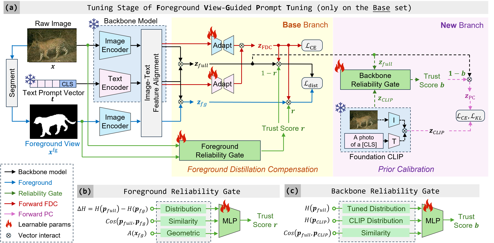

# FVG-PT: Adaptive Foreground View-Guided Prompt Tuning for Vision-Language Models

> **FVG-PT: Adaptive Foreground View-Guided Prompt Tuning for Vision-Language Models** <br>
> Haoyang Li<sup>1,2</sup>, Liang Wang<sup>1,2</sup>, Siyu Zhou<sup>1</sup>, Jiacheng Sun<sup>2</sup>, Jing Jiang<sup>1</sup>, Chao Wang<sup>2</sup>, Guodong Long<sup>1</sup> and Yan Peng<sup>2</sup>. <br>
> _<sup>1</sup>University of Technology Sydney &emsp; <sup>2</sup>Shanghai University_ <br>

<hr />

### 📜 Abstract
CLIP-based prompt tuning enables pretrained Vision-Language Models (VLMs) to efficiently adapt to downstream tasks. Although existing studies have made significant progress, they pay limited attention to changes in the internal attention representations of VLMs during the tuning process. In this paper, we attribute the failure modes of prompt tuning predictions to shifts in foreground attention of the visual encoder, and propose **F**oreground **V**iew-**G**uided **P**rompt **T**uning (**FVG-PT**), an adaptive plug-and-play foreground attention guidance module, to alleviate the shifts. Concretely, FVG-PT introduces a learnable Foreground Reliability Gate to automatically enhance the foreground view quality, applies a Foreground Distillation Compensation module to guide visual attention toward the foreground, and further introduces a Prior Calibration module to mitigate generalization degradation caused by excessive focus on the foreground. Experiments on multiple backbone models and datasets show the effectiveness and compatibility of FVG-PT.

### 🔍 Framework

<div style="text-align:center"></div>

<figcaption class="content has-text-left"  style="word-break:normal">Figure 1. Overview of our proposed <strong>FVG-PT</strong>. As a plug-and-play method, in (a) tuning stage, FVG-PT obtains the foreground view x^fg of image x and fine-tunes the learnable (b) <em><strong>Foreground Reliability Gate</strong></em> to learn an adaptive foreground trust score r. Meanwhile, <em><strong>Foreground Distillation Compensation</strong></em> module inserts adapters after image-text alignment of frozen backbone model to guide visual attention toward the foreground. In parallel, independent <em><strong>Prior Calibration</strong></em> fine-tunes the (c) Backbone Reliability Gate on the decoupled new branch (indicated by <em>dashed lines</em>) to balance the tuned model and the CLIP prior. </figcaption></p>

### 💡 Our previous work on prompt tuning

- **[CVPR 25] DPC: Dual-Prompt Collaboration for Tuning Vision-Language Models**    
Haoyang Li, Liang Wang, Chao Wang, Jing Jiang, Yan Peng and Guodong Long.   
[[Paper](https://arxiv.org/abs/2503.13443)]  [[Project Page](https://github.com/JREion/DPC)] [[Poster](https://github.com/JREion/DPC/blob/main/docs/DPC_Poster.png)]

- **[ICME 25] MAO: Efficient Model-Agnostic Optimization of Prompt Tuning for Vision-Language Models**    
Haoyang Li, Siyu Zhou, Liang Wang and Guodong Long.  
[[Paper](https://arxiv.org/abs/2503.18160)]  [[Project Page](https://github.com/JREion/M.A.O)] [[Poster](https://github.com/JREion/M.A.O/blob/main/docs/Poster_of_M.A.O.png)]

- **[arxiv] Raw Data Matters: Enhancing Prompt Tuning by Internal Augmentation on Vision-Language Models**    
Haoyang Li, Liang Wang, Chao Wang, Siyu Zhou, Jing Jiang, Yan Peng and Guodong Long  
[[Paper](https://arxiv.org/abs/2508.02671)]  [[Project Page](https://github.com/JREion/AugPT)]

<hr />

### ⚙️ Running
1. Create the environment and install Dassl.pytorch library. Please follow the instructions detailed in [INSTALL.md](https://github.com/JREion/FVG-PT/blob/main/docs/INSTALL.md).
2. Prepare the dataset. We release 11 prompt-tuning datasets _with foreground views_ on [[🤗HuggingFace](https://huggingface.co/datasets/JREion/Prompt_Tuning_Datasets_with_Foreground)], just use them directly.
   <br> These foreground views are generated by [SEEM](https://github.com/UX-Decoder/Segment-Everything-Everywhere-All-At-Once). They are put in the `./mask` folder in each dataset.
4. Run fine-tuning script on the backbone models first (e.g., CoOp): <br>
   ```bash
   python run_tuning.py --dataset caltech101 --trainer CoOp --seed_list 1 --sub_class base
   python run_tuning.py --dataset caltech101 --trainer CoOp --seed_list 1 --sub_class new
   ```
5. Run FVG-PT fine-tuning based on the pre-tuned backbone models: <br>
    ```bash
     python run_tuning.py --dataset caltech101 --trainer FVGPT_CoOp --seed_list 1 --sub_class base --lambda_base 10.0
     python run_tuning.py --dataset caltech101 --trainer FVGPT_CoOp --seed_list 1 --sub_class new --lambda_base 10.0
     ```

### Code Statement
We are still working on organizing the code repository. We promise to release our code implementation in the future.
